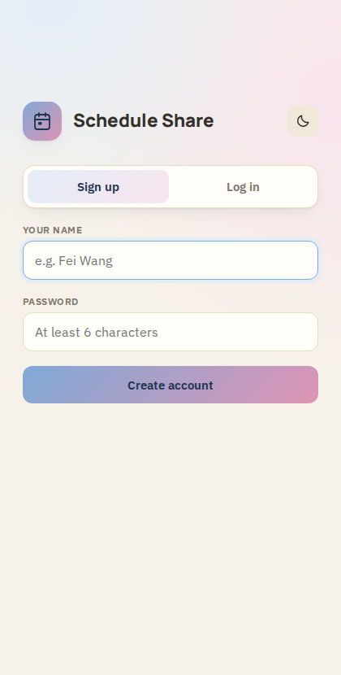
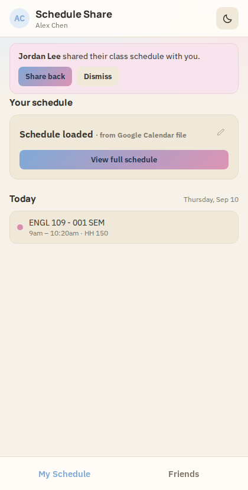
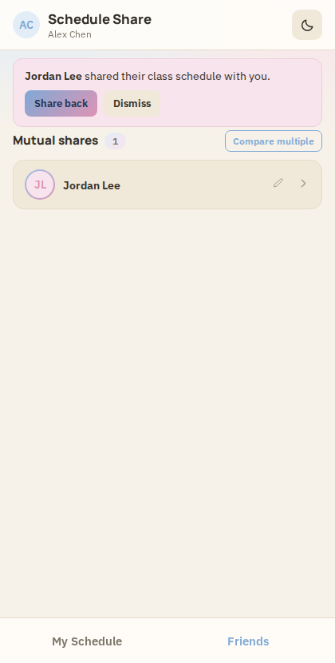
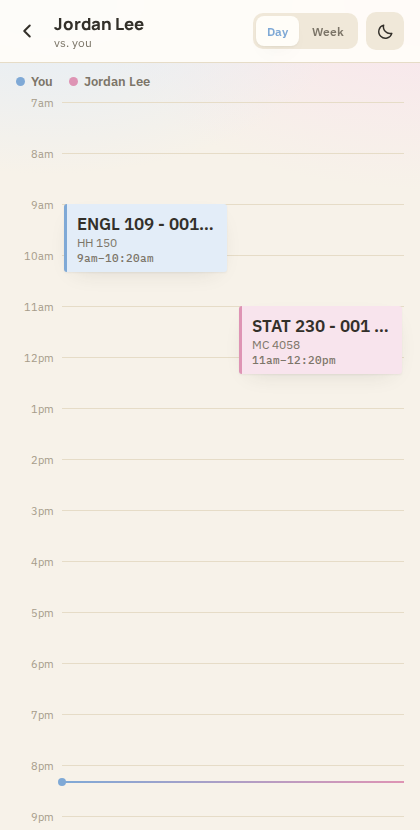
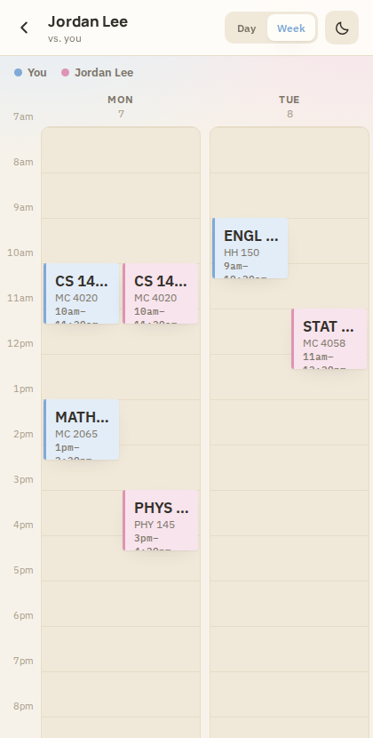
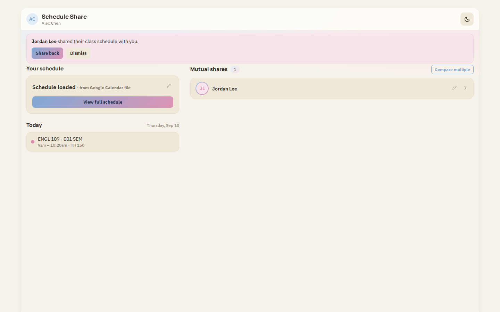

# Schedule Share

A web app for comparing class schedules with classmates. Sign up with a name
and password, upload your schedule, and see it side by side with anyone who
shares back with you.

## Screenshots

*(Shown with two demo accounts — Alex Chen and Jordan Lee — using made-up class schedules.)*

<table>
<tr>
<td></td>
<td></td>
<td></td>
</tr>
<tr>
<td></td>
<td></td>
<td></td>
</tr>
</table>

## How it works

The frontend is a single-page Next.js app. Login is Firebase Auth
(email/password under the hood, using a synthetic email built from your
name). Accounts, schedules, share relationships, and notifications are all
stored in Firestore.

A schedule can be added two ways:

- Upload a `.ics` file exported from Google Calendar. It's parsed entirely
  in the browser: only events that repeat weekly or daily are kept (so
  one-off events like appointments or birthdays are dropped), the title has
  to look like a course code (e.g. "CS 145"), and everything is limited to
  Monday through Friday.
- Upload a screenshot of your schedule. This is sent to a server route
  (`app/api/parse-schedule/route.js`) that calls the Gemini API to read the
  image and return the same structured class list.

Reuploading a schedule replaces the old one completely.

Once two people share their schedules with each other, they show up as a
mutual share and either can open a comparison: a day view (like Google
Calendar) with both people's classes side by side, or a full week view.
Class dots are colored by subject: CS/engineering courses are blue, math is
purple, humanities and social sciences are pink, sciences are green,
business/econ is amber, anything unrecognized is gray.

## Deployment

Hosted on Vercel, connected to this GitHub repo. Pushing to `main` deploys
automatically. Firebase (Auth + Firestore) and the Gemini API key are
configured through environment variables in the Vercel project settings.

## Using it

1. Sign up with your name and a password.
2. Upload your schedule (screenshot or `.ics` file) from the My Schedule tab.
3. In the Friends tab, share your schedule with classmates who've signed up.
4. Once someone shares back with you, they appear under Mutual Shares. Tap
   them to compare schedules.

## Running locally

You'll need your own Firebase project (Authentication with Email/Password
enabled, and a Firestore database) and a Gemini API key.

1. Copy `.env.local.example` to `.env.local` and fill in the Firebase and
   Gemini values.
2. `npm install`
3. `npm run dev`, then open http://localhost:3000.

To deploy the Firestore security rules in `firestore.rules`:

```
npx firebase-tools login
npx firebase-tools use --add
npx firebase-tools deploy --only firestore:rules,firestore:indexes
```
